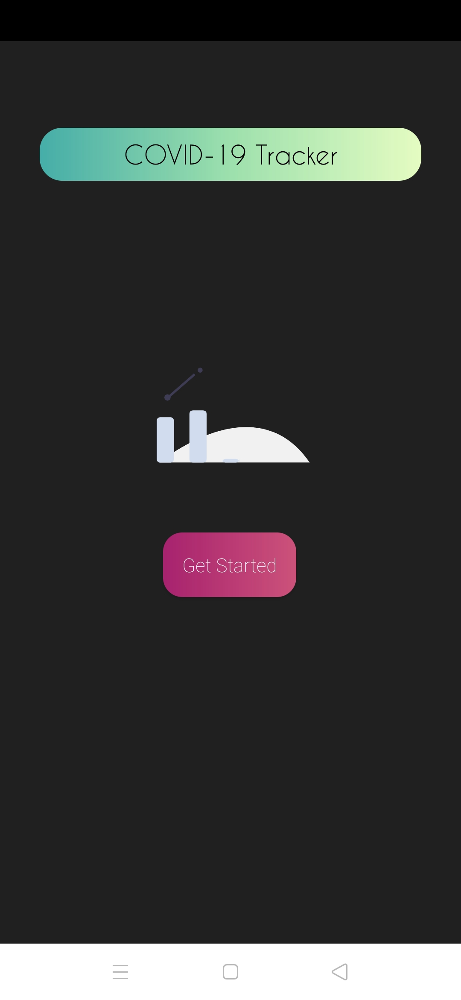
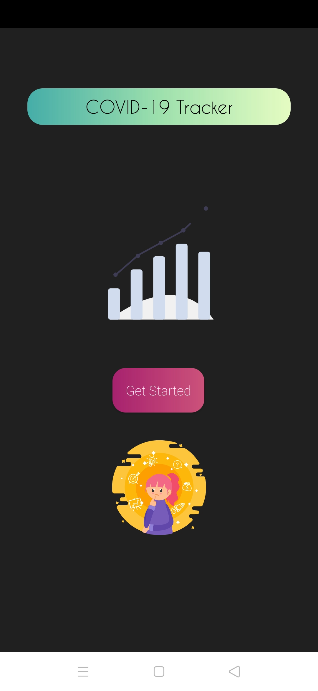
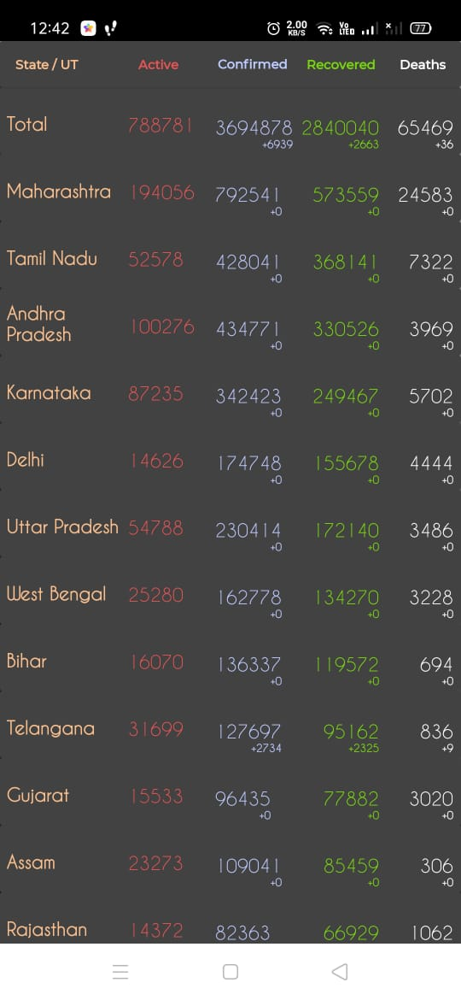
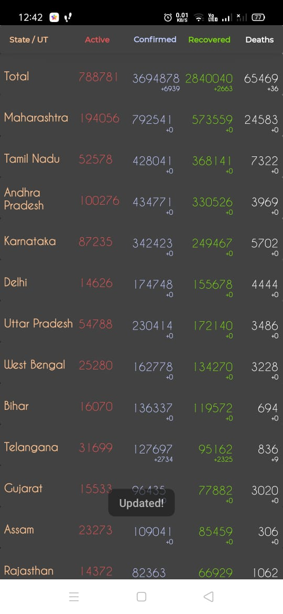
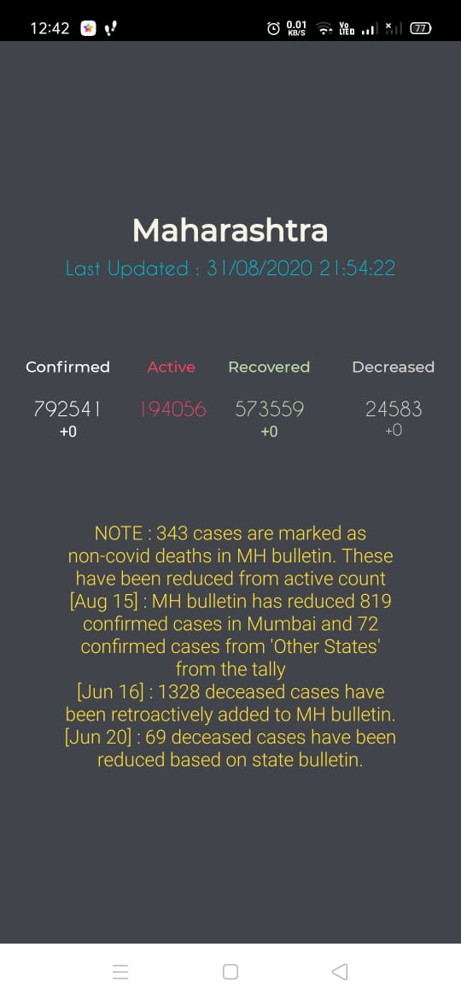

# Covid-19 India Tracker : Android App
Android app to fetch and display recent Covid-19 India data using covid19india.org API.

## Features 
* Official data from **covid19india.org** API.
* **Swipe to refresh** feature.
* View status for individual states : **Tap to display** details.
* Neat UI with some animations included.

## Technologies used 
* Entire code is based on **JAVA**.
* Uses **Retrofit Library** for Network handling.
* Uses a **Recycler view** for displaying data.
* Uses **Lottie Library** for Animations.

## Screenshots
     
